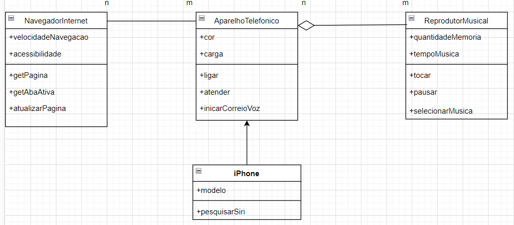

Análise de negócios, requisitos, conceitos da programação orientada a objetos e modelagem 
UML. Um programa feito com diagramação de classes e interfaces com a proposta de representar
os papéis do iPhone como: Reprodutor Musical, Aparelho Telefônico e Navegador na Internet. 

